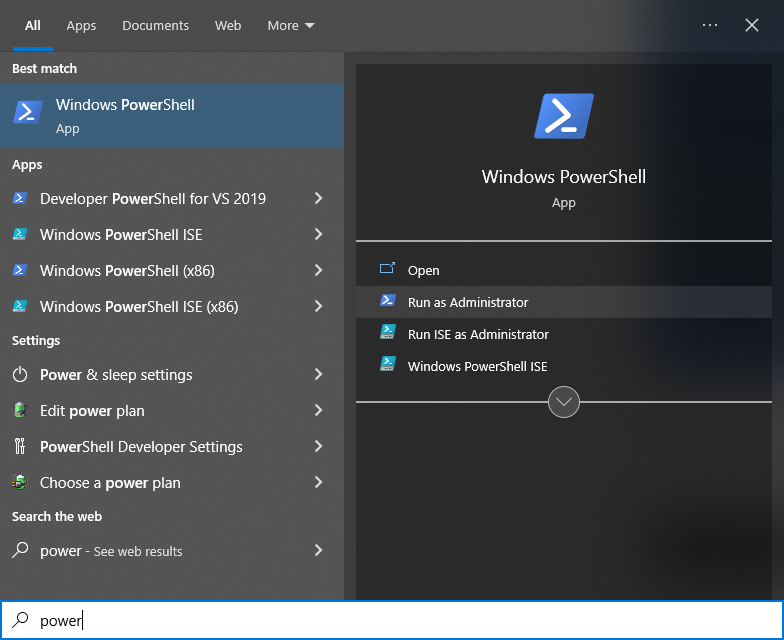
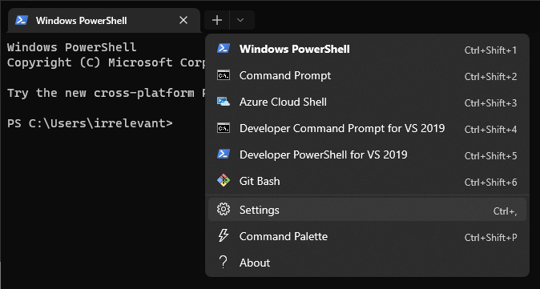
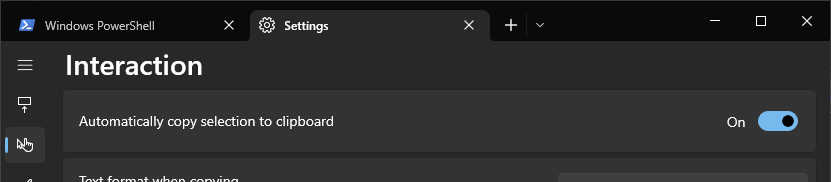

# Setup Development Environment
TODO: explain why this setup is valuable

Software to be installed:
- [Chocolatey](https://docs.chocolatey.org/en-us/why) - a package manager for Windows
- [Windows Terminal](https://github.com/microsoft/terminal) - new, modern, feature-rich, terminal application for command-line users
- [Visual Studio Code](https://code.visualstudio.com/docs) - lightweight but powerful source code editor
- [Python 3.10](https://docs.python.org/3.10/tutorial/index.html) - easy to learn, powerful programming language

### Security Note
Powershell has a security feature for running scripts. We'll be setting it for the current user to `RemoteSigned`. This provides a little security by only running signed remote scripts that execute as part of a download. Our interest is so local scripts can run without issue, which is need for the powershell profile and various installation scripts chocolatey executes.

### Packages
**Package** refers to bundled up collections of software the contain the files, registry edits, user settings, system settings, etc that are needed for the it to properly run on a system. **Package management** is the process of automating the install and configuration of software.

Package management in windows is typically manual. Performed by visiting a website and clicking a download link. The saved file usually ends in `.exe` or `.msi` and runs an installation wizard prompting for input. There are many applications that only need the relevant files and can be "installed" by extracting them from an archive (i.e., unzipping). However, often there are still modifications that need to be made. This is tedious and error prone when trying to share how to setup an environment for developing programs.

This is why Chocolatey is valuable. It removes the need for full how-to steps in installing the software above. I don't need to write them and you don't need to read them, or worry about configuring something incorrectly. Copy and paste the commands that follow and you should be writing python comfortably within the hour.

## Chocolatey
1. Open the start menu and search for powershell, then select _Run as Administrator_.  

2. Create your powershell profile (continue to step 3 if it already exists).
   ```pwsh
   New-Item $profile
   ```
3. Set policy to `RemoteSigned`.  
   ```pwsh
   Set-ExecutionPolicy RemoteSigned -Scope CurrentUser
   ```
4. Enable TLS (Transport Layer Security) version 1.2 (required to connect to chocolatey servers)  
   ```pwsh
   [System.Net.ServicePointManager]::SecurityProtocol = [System.Net.ServicePointManager]::SecurityProtocol -bor 3072
   ```
5. Download and run install script.  
   ```pwsh
    Invoke-Expression ((New-Object System.Net.WebClient).DownloadString('https://community.chocolatey.org/install.ps1'))

## Windows Terminal
Continue in the same administrator powershell window from chocolatey install. Otherwise open a new administrator powershell.
1. Install it with chocolatey.  
   ```pwsh
   choco install microsoft-windows-terminal -y
   ```
2. Now you can leave the default powershell and start working in terminal. Find it in your start menu and then open the settings.  

3. Within *Interactions* enable _Automatically copy selection to clipboard_.  

4. Review some of the other settings and customize to your liking.

## Visual Studio Code
`Ctrl+Click` on _Windows Powershell_ from the drop down menu in terminal to run as administrator. This is needed whenever using chocolatey.
1. Install with chocolatey.  
   ```pwsh
   choco install vscode -y
   ```
2. Open VS Code and press `Ctrl+Shift+X` to get to the extensions tab (also on the left sidebar).
3. In the top left search for "python" and install the offical extension (top result).

## Python 3.10
Continue in an administrator window.
1. Install with chocolatey.
   ```pwsh
   choco install python310 --params="/NoLockdown"
   ```
2. Verify install by checking version. Both `py` and `python` do the same thing, one is just shorter to type.
   ```pwsh
   py -V
   python -V
   ```
3. Update (install if missing) `pip`, `setuptools`, and `wheel` modules. These help with further module installations, but aren't always installed by default.
   ```pwsh
   py -m pip install -U pip
   py -m pip install -U setuptools
   py -m pip install -U wheel
   ```